# 🧑‍💻 Resume / Portfolio Web Application

Kişisel **CV ve portföyümü** sergilemek için geliştirilmiş,  
**ASP.NET Core MVC** tabanlı modern bir web uygulamasıdır.

Admin paneli üzerinden tüm içerikler **dinamik olarak yönetilir**  
ve veriler **doğrudan veritabanından** çekilir.

---

## ✨ Öne Çıkan Özellikler

### 🎨 Modern UI / UX
- Glassmorphism kart tasarımları  
- Gradient arka planlar  
- Tam responsive (mobil uyumlu) yapı  
- Timeline görünümü (deneyimler)  
- Grid layout ile proje sergileme  
- AOS (Animate On Scroll) animasyonları  

---

## 🌐 Kullanıcı (Portföy) Tarafı

### 🏠 Ana Sayfa
- Hero section  
- Dinamik içerikler  

### 👤 Hakkımda
- Profil bilgileri  
- **Devamını Oku** özelliği  
- CV indirme butonu  

### 💼 Deneyimler
- Timeline görünümü  

### 🎓 Eğitim
- Akademik geçmiş  
- Sertifikalar  

### 🚀 Yetenekler
- Animasyonlu progress bar’lar  
- Kategori bazlı filtreleme  

### 📁 Projelerim
- Kategoriye göre filtreleme  
- Hover efektli proje kartları  

### 📧 İletişim
- Mesaj gönderme formu  
- Veritabanına kayıt  

---

## 🔐 Admin Paneli

### 📊 Dashboard
- Toplam proje sayısı  
- Toplam mesaj sayısı  
- Okunmamış mesaj sayacı  

### 📝 CRUD İşlemleri
- About Me (Hakkımda)  
- Skills (Yetenekler)  
- Experience (Deneyimler)  
- Education (Eğitim)  
- Portfolio (Projeler)  
- Category (Kategoriler)  
- Messages (Mesajlar)  

### 📧 Mesaj Yönetimi
- Okundu / okunmadı işaretleme  

### 🖼️ Medya Yönetimi
- Profil fotoğrafı yükleme  
- Proje görselleri yükleme  

### 🎨 Sidebar
- Aktif sayfa vurgulama  
- Hover efektleri  

### 🔔 Bildirimler
- Admin panelinde anlık mesaj bildirimleri  

---

## 🛡️ Güvenlik & Performans
- Entity Framework Core ile güvenli veri erişimi  
- ViewComponent yapısı  
- Pagination desteği  
- Static file optimizasyonu  

---

## 🛠️ Kullanılan Teknolojiler

### Backend
- ASP.NET Core 8.0 MVC  
- Entity Framework Core (Code First)  
- MS SQL Server  
- LINQ  

### Frontend
- Razor Views & ViewComponents  
- Tailwind CSS  
- Bootstrap 5  
- JavaScript  
- AOS (Animate On Scroll)  

### Araçlar
- Visual Studio 2022  
- SQL Server Management Studio  
- Git & GitHub  

🖼️ Ekran Görüntüleri
🌐 Portföy (Kullanıcı) Tarafı

  

🔐 Admin Paneli

  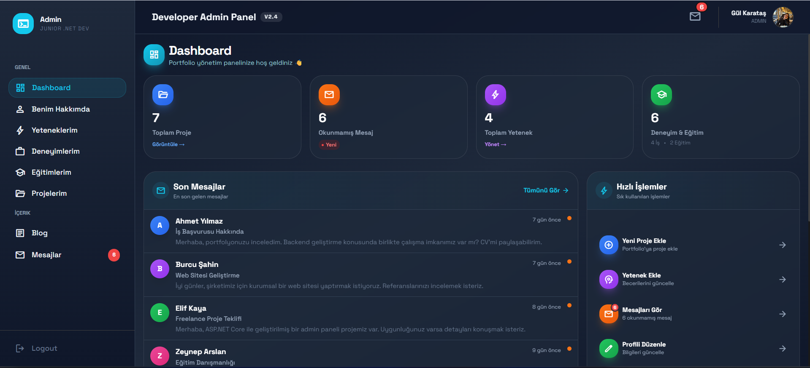
  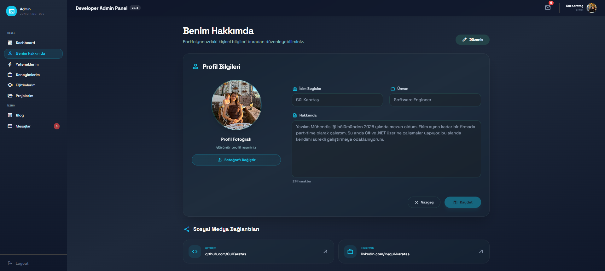

  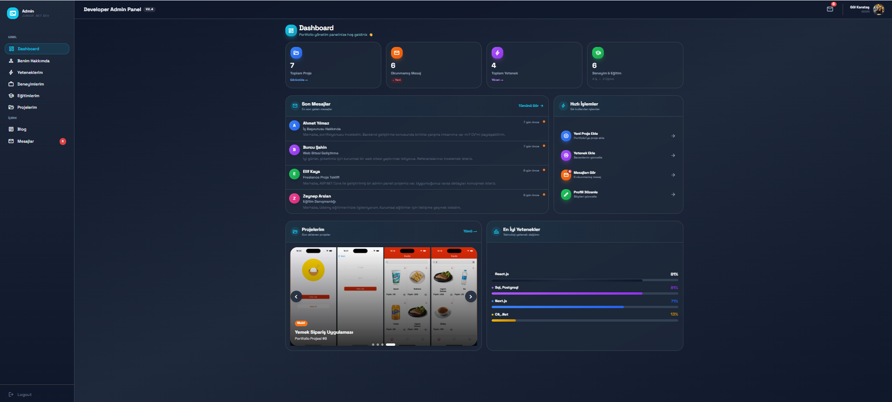
  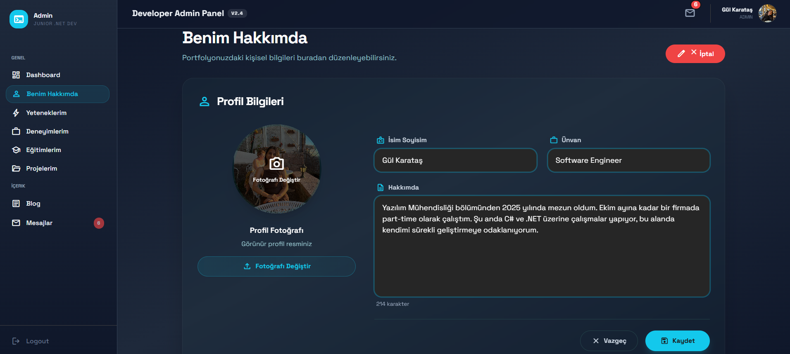

  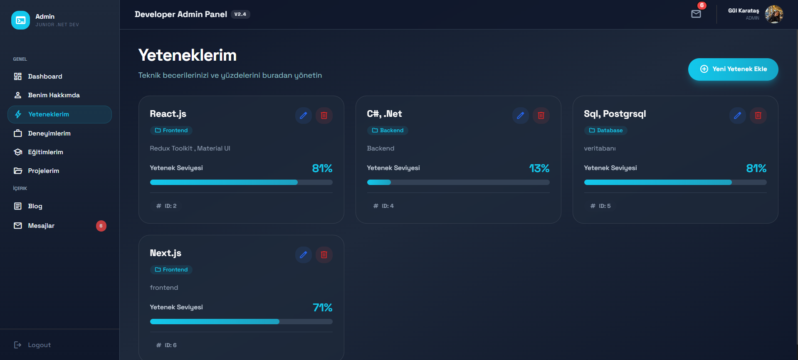
  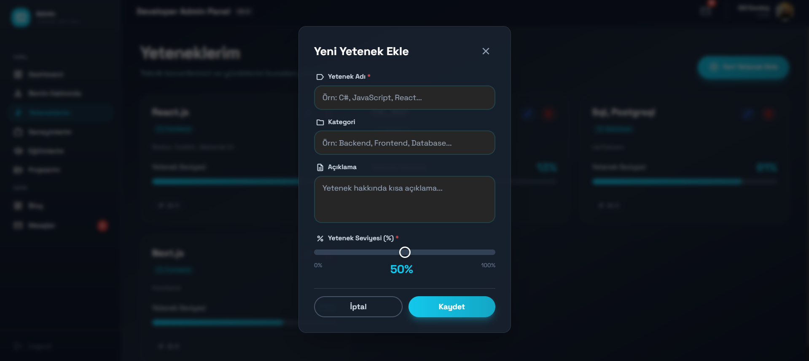

  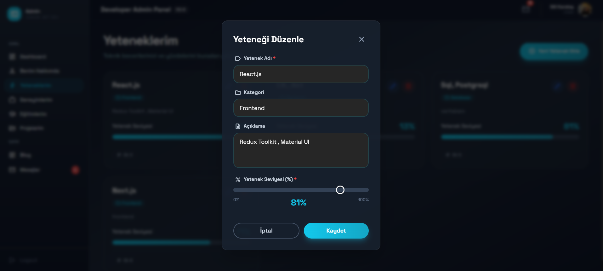
  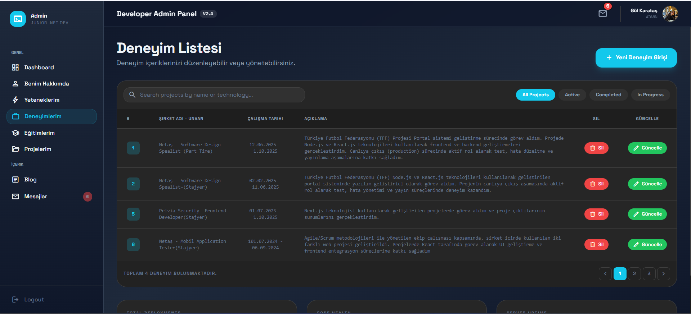

  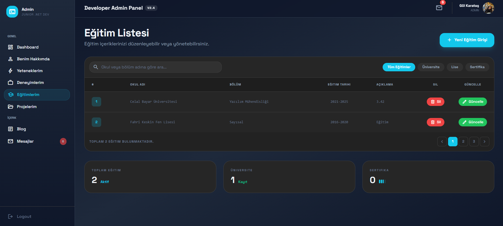
  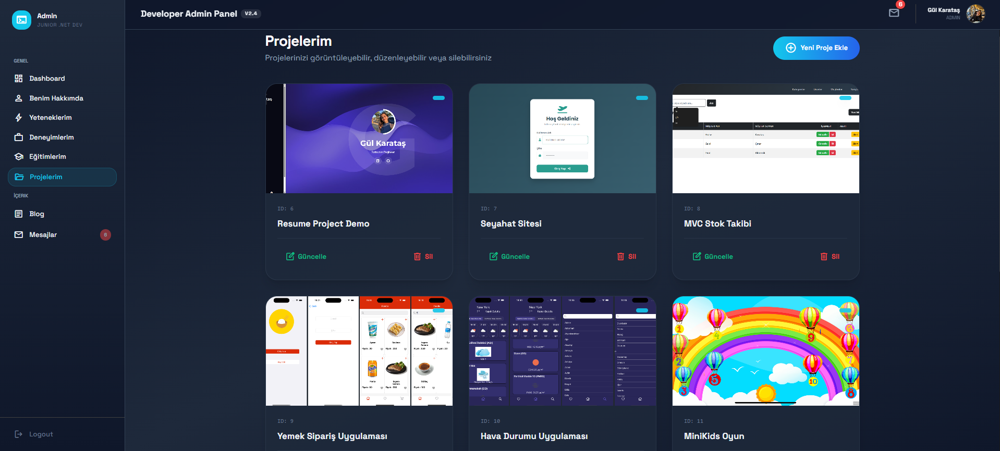

  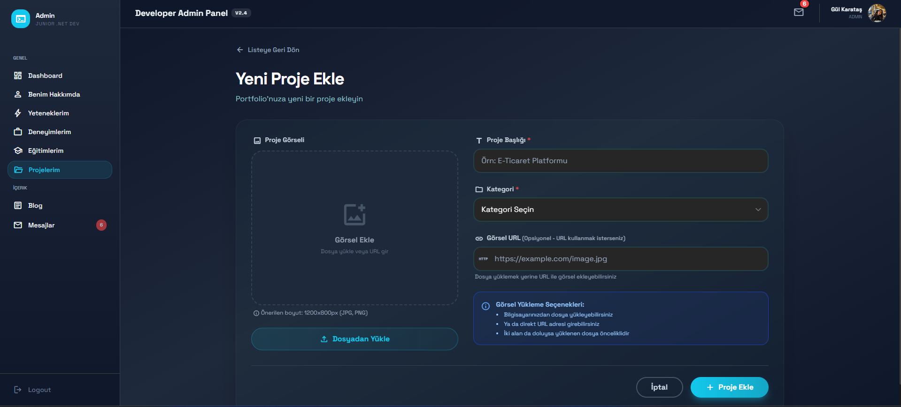
  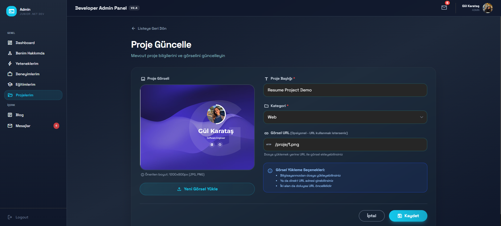

  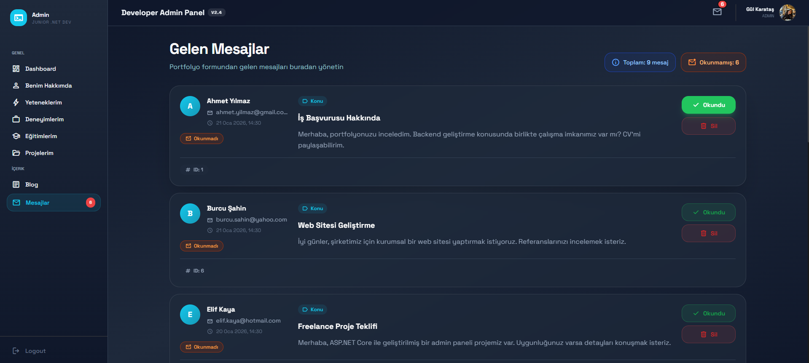

